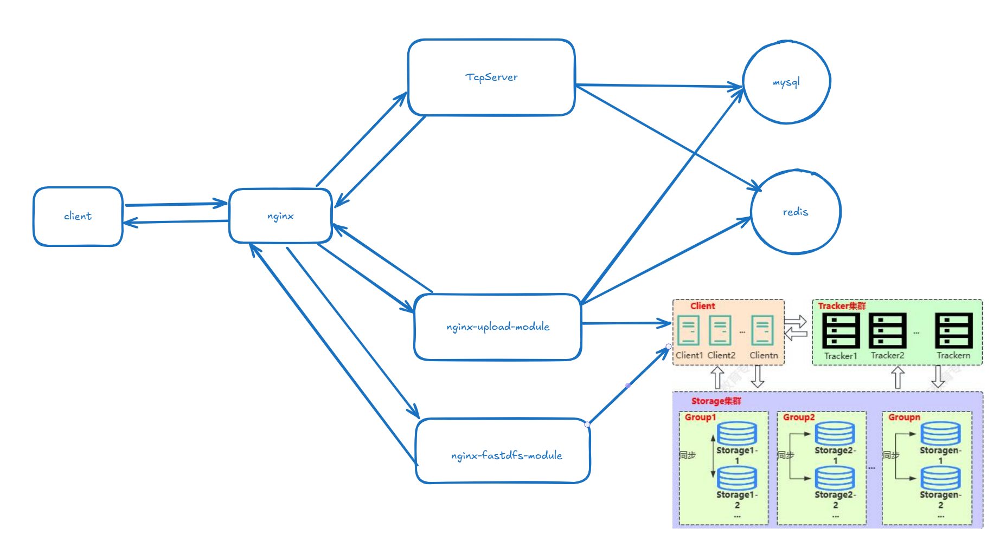

# Cloud-disk
# 一个y用于学习交流的云盘项目

项目环境：Ubuntu24.04

项目用到的开源框架：nginx、fastdfs, rapidjson, muduo

# 运行项目

```shell
#这里默认前面提到的依赖都已经准备好测试无误了
#并且配置文件也修改完毕
mkdir build && cd build
cmake ..
make
```

# 项目实现的功能

#### 有一个web服务器

- 静态资源部署, 都在front目录下
- 动态请求 - 基于muduo的tcpServer
  - 注册
  - 登录
  - 上传
  - 下载
  - 秒传
  - 文件列表的获取
  - 分享
  - 取消分享
  - 下载分享的文件
  - 下载榜

# 项目的整体框架图




# 项目的一些缺陷

1.上传文件时会先临时保存到本地，导致磁盘io太多性能不理想。

2.api部分代码不美观。

# 后面的一些计划

​	1.优化上传文件的性能。
​	2.优化api的代码。
​	3.完成短链功能

# 最后

有兴趣一起交流的加我QQ:2681457694
